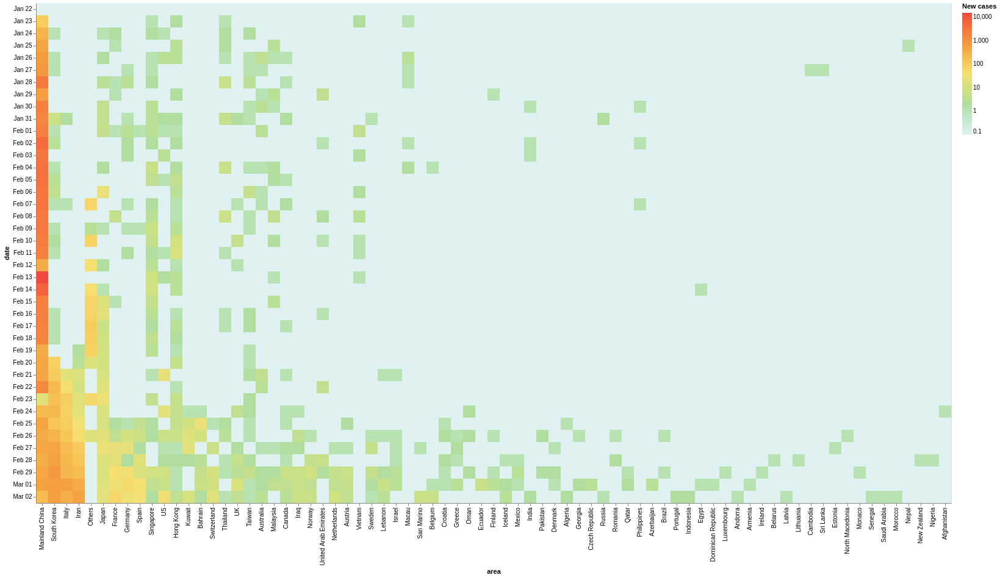

# endcoronavirus-yellowteam.github.io

Centralizing visualizations of yellow team, let's organize visualizations

Ideally, each visualization should come with:
* picture
* link to source code
* link to interative version if available
* reference to datasource
* methodology

## About Coronavirus

Visualizations related to the virus spread, effect...

## World

Visualizations related to world status

### Basic

* New cases*

Source https://github.com/CSSEGISandData/COVID-19

### In depth

## Country by country visualization
